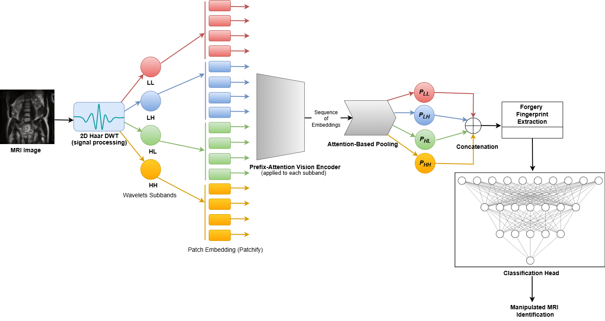

# Forensic Detection of Generated MRI Imagery Using Autoregressive Modeling and Frequency Analysis

<p align="center">
 
</p>

## [paper](https://openaccess.thecvf.com/content/WACV2026W/SAFE-2026/html/Mahara_Forensic_Detection_of_Generated_MRI_Imagery_Using_Autoregressive_Modeling_and_WACVW_2026_paper.html)

## Code
Official implementation of the paper: "Forensic Detection of Generated MRI Imagery Using Autoregressive Modeling and Frequency Analysis"

This repository introduces **AIM-DWT**, a novel forensic detection framework that integrates **Autoregressive Image Models (AIM)** with **Discrete Wavelet Transform (DWT)** for robust and generalizable detection of synthesized MRI images.

### Overview
The implementation covers two major components:
1. Generative Methods for MRI Image Synthesis  
   
   Used to generate synthetic MRI images from various model families: GANs, Diffusion, and Autoregressive. Please refer to [`Generative_Methods`](Generative_Methods).

3. AIM-DWT Forensic Detection
   
   Please see below for code execution on training and testing

## Installation

- Clone the repository:
   ```bash
   git clone https://github.com/xxxxx/AIM-DWT.git
   cd AIM-DWT
   ```
- Create a Python virtual environment (optional)
  ```bash
   python3.9 -m venv myvenv
   source myvenv/bin/activate
  ```
- Install required dependencies and packages
  ```bash
  pip3.9 install -r requirements.txt
  ```
- Train the AIM-DWT:
```bash
python3.9 train.py --train_path ./datasets/train/ --val_path ./datasets/val/ --total_epochs 150 --batch_size 256
```
The model's weight will be stored at `./saved_models/`.

- Pretrained Weights:
  Pretrained weights can be downloaded from [pretrained_weights](https://drive.google.com/drive/folders/1Ix80ZY6D1D8bbiBRDNjVEQu1rTYdWapL?usp=sharing)

- Test the AIM-DWT:
```bash
python3.9 test.py --test_path /path/to/test_dataset/ --checkpoint_path /path/to/saved_models/weight.pth
```
> Note: The training, validation, and test dataset directories should follow the ImageFolder structure:
```
folder/
├── 0_real/
└── 1_fake/
```

---

### Acknowledgment

This work builds upon the ideas presented in the paper:  
[**Multimodal Autoregressive Pre-training of Large Vision Encoders**](https://arxiv.org/abs/2411.14402), published by [Apple ML Research](https://github.com/apple/ml-aim).  
We thank the authors for their excellent work and open-source contributions.


